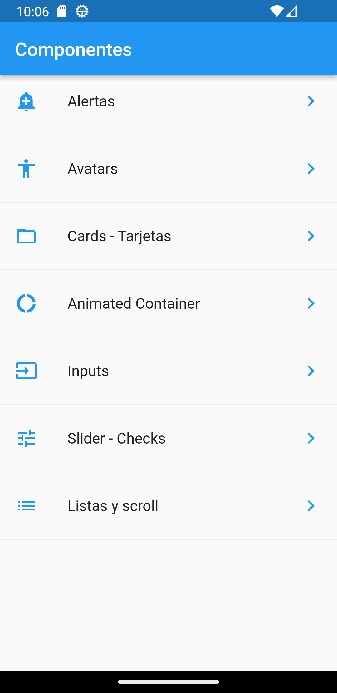
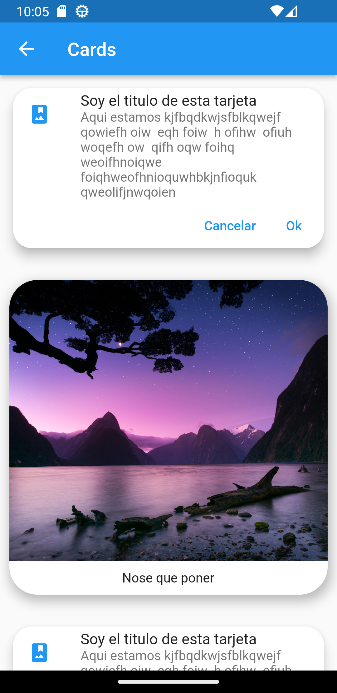
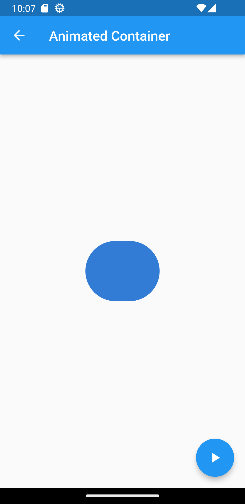
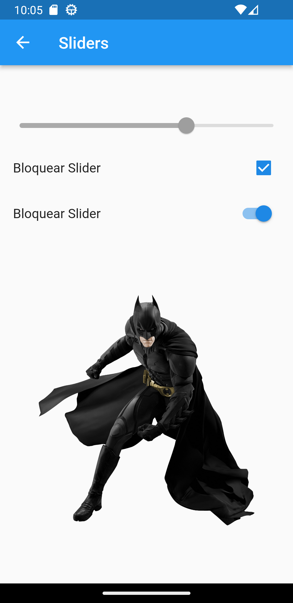

# Flutter components

It happens that when you start with Flutter the number of components and widgets that there are in addition to the Dart syntax is a bit overwhelming, so this app is made to review everything and demonstrate how it works.

  
  
  
  
  
  
  
  

